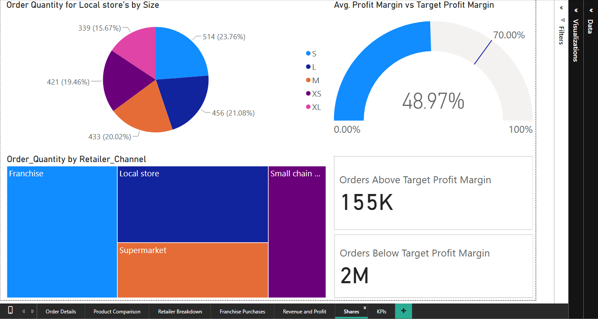
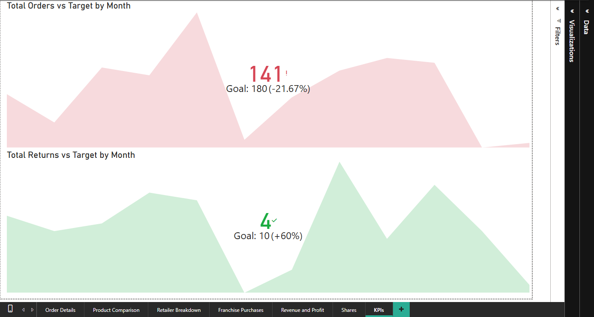

# threads-ltd-powerbi-analysis
Power BI interactive dashboard analyzing retail sales and product return metrics for Threads Ltd.

#  Threads Ltd: Multi-Stakeholder Enterprise Performance Framework

An end-to-end business intelligence solution developed in Power BI for a fictitious UK-based clothing enterprise. This project translates raw relational sales records into interactive, executive-ready dashboard interfaces optimized for business strategy.

---

##  1. Sales Discovery & Portfolio Auditing (Head of Sales View)

**Objective:** Provide the Head of Sales with deep-dive transaction visibility and performance metrics to guide inventory selection and future catalog expansions.

| Visual Feature | Technical Execution & Slicers | Strategic Business Value |
| :--- | :--- | :--- |
| **Granular Transaction Matrix** | • Tabular reporting of `Order_ID`, `Product_SKU`, `Order_Quantity`, and `Sales_Amount`.  • Dynamic context filtering via **Year** and **Product Name** slicers. | • Allows line-by-line validation of sales velocity. • Empowers regional team leads to spot operational anomalies instantly. |
| **Sales vs. COGS Scatter Plot** | • Relational scatter mapping correlating absolute `Sales_Amount` against `Cost_of_Goods_Sold (COGS)` across chronological deal milestones. | • Isolates the linear relationship between revenue generation and baseline expenses. • Flags high-cost transactions that drag down overall profit. |
| **Product Expansion Bubble Chart** | • X-Axis: `Sales_Amount`  • Y-Axis: `Average of Product_Price`  • Bubble Volume/Size: Z-Axis scaled by `Order_Quantity`. | • Serves as a data-driven checkpoint for adding "Tank Tops" to the catalog. • Visualizes three intersecting metrics simultaneously to de-risk inventory investment choices. |

---

##  2. Product Volume Optimization (Product Manager View)

**Objective:** Evaluate product performance across retail segments to shape marketing campaigns and fine-tune communication with channel partners.

| Visual Feature | Technical Execution & Slicers | Strategic Business Value |
| :--- | :--- | :--- |
| **Target Catalog Benchmarking** | • Filter parameters: `Gender = Women`, `Channel = Supermarket`, `Year = 2021`.  • Implemented dynamic reference boundaries via the **Analytics Pane**. | • Separates high-performing assets from stagnant inventory. • Evokes an immediate emotional response by showing exactly which lines missed corporate sales goals. |
| **Channel Velocity Stacked Bar** | • Horizontal stacked distribution charting `Total Order Quantities` per channel segment, split by `Product_Category`. | • Maps supply-chain velocity across networks. • Identifies Franchise and Supermarket outlets as high-volume channels requiring larger marketing spend. |
| **Small Multiples Grid Matrix** | • Multi-pane matrix isolation tracking `Hoodies & Sweatshirts` across Franchise outlets. • Cross-references product colorways against `Product_Gender` types. | • Replaces clutter with a clean, unified layout. • Exposes micro-trends in color and gender preference without increasing user cognitive load. |

---

##  3. Margin Security & Corporate Performance (CCO View)

**Objective:** Answer the Chief Commercial Officer's core questions regarding bottom-line margin shrinkage relative to overall top-line revenue growth.

| Visual Feature | Technical Execution & Slicers | Strategic Business Value |
| :--- | :--- | :--- |
| **Financial Tracker Line Chart** | • Dual-axis timeline plotting `Total Sales Amount`, `Total COGS`, and `Gross Profit`. | • Highlights historical cost anomalies. • Shows the exact dates where rising COGS compressed gross profits despite rising sales volumes. |
| **Layered Volume Area Chart** | • Layered timeline charting changing financial metrics over time. | • Evaluates user-interface design choices. • Confirms that while area charts are excellent for aggregate volume, overlapping fields hide cross-over trends. |
| **Profit Margin Combo Chart** | • Combination chart plotting a counting variable (`Gross Profit` bars) alongside a rate variable (`Average Profit Margin` lines) over time. | • Directly answers the CCO's concerns by proving that an increase in top-line revenue does not automatically equal healthier operating profit margins. |

---

##  4. Footprint Analytics & Target KPI Tracking

**Objective:** Optimize regional shelf allocations by experimenting with distinct ways to show shares of a whole, while monitoring operational targets.

| Visual Feature | Technical Execution & Slicers | Strategic Business Value |
| :--- | :--- | :--- |
| **Size Distribution Pie Chart** | • Tracks the proportional breakdown of clothing size categories (`S, M, L, XL, XS`) ordered by the Local Store channel. | • Demonstrates the high utility of standard pie charts when monitoring simple, clean shares of a static total. |
| **Channel Footprint Treemap** | • Hierarchical rectangle map scaling absolute order quantities against total channel footprints. | • Proves treemap superiority when handling complex categories. • Makes it easy for leadership to see that Franchise channels dominate wholesale purchase volumes. |
| **Executive Target KPI Cards** | • Displays total monthly order changes alongside return target gauges (`Goal: 180` for Orders and `Goal: 10` for Returns). | • Highlights performance variance using color-coded logic (red/green). • Instantly informs the leadership team of critical performance gaps against operational targets. |

---

##  Data Architecture & Specifications

* **Data Model (Star Schema):** Designed clear, one-to-many relationship vectors mapping dimension tables (`Products`, `Retailers`, `DateTable`) into central transaction fact tables (`Orders`, `Returns`).
* **Design Guidelines:** Maintained strict color palette discipline (teal/slate profiles) to reduce cognitive load and deliver executive-grade reports.
